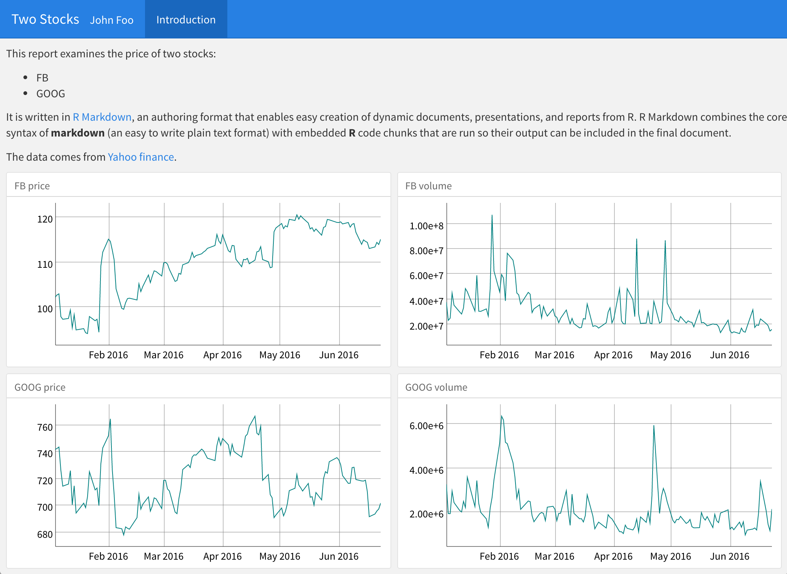
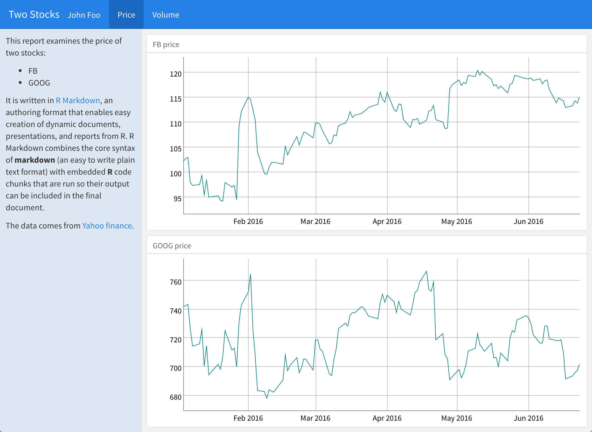

## Exercises   

1. Remove all of the line breaks from [this document](two_stocks.Rmd). Then turn it into a flexdashboard like the one below. The price graphs are in their own column, as are the volume graphs.

2. Use `{.sidebar}` to move the text at the top of your dashboard into a sidebar. Then migrate each column to its own page. The results should look like this:

