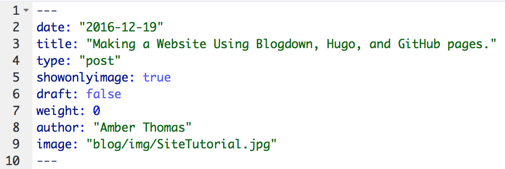
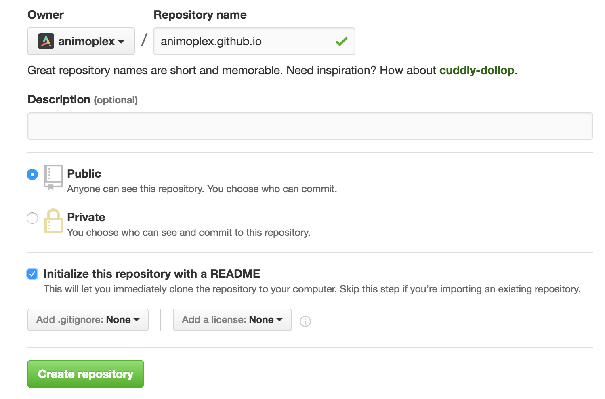
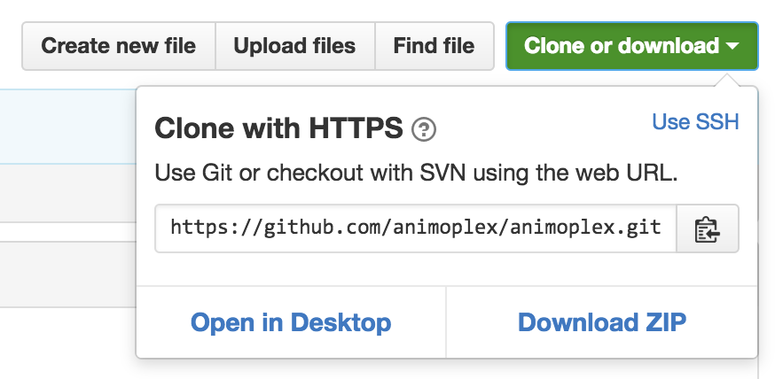
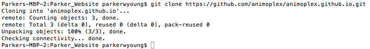

### Blogdown

[Blogdown](https://github.com/rstudio/blogdown) is a new package for R and RStudio that helps you to create blog posts and other types of web content using the RMarkdown language. At the time of this post's writing, it has 8 functions:

* **build_site()** : Compiles all .Rmd files into Hugo-readable HTML & builds the site
* **html_page()** : Renders .Rmd file into Hugo-readable HTML
* **hugo_cmd()** : Allows you to run Hugo commands
* **install_hugo()** : Downloads the appropriate Hugo files to your computer to allow site generation
* **install_theme()** : Downloads the specified theme from GitHub
* **new_content()** : Generates a new file in your working directory
* **new_site()** : Creates the environment necessary for a new site
* **serve_site()** : Allows you to preview a working version of your site

<i class="fa fa-arrow-circle-right" aria-hidden="true"></i> ***Disclaimer: Again, since there is no formal documentation for blogdown yet, those definitions come from the function descriptions and my experience with using them***

Blogdown runs using Hugo, so we'll look at that next. 

### Hugo

Hugo is a static-site generator, meaning that instead of generating your website from scratch everytime someone visits your page, the pages are already made and ready to go when someone arrives ([more info here](https://davidwalsh.name/introduction-static-site-generators)). It's also open-source and free, which I appreciate. 

While I highly recommend going and reading some of the documentation on the [Hugo website](https://gohugo.io/overview/introduction/) I'll cover the important vocabulary for getting started on this process here. If you're already familiar with Hugo, you can [skip this part](#github). 

* **[Themes](https://gohugo.io/themes/overview/)** : These are user-generated files for formatting your website. Find one you like [here](http://themes.gohugo.io/).
* **Templates** : Templates come from the theme and determine the look of a specific type of page. Hugo uses two types of page templates by default:
      + **[Single](https://gohugo.io/templates/content#single-page)** : This type is for pages that will only have one kind of content (e.g., a blog post)
      + **[List](https://gohugo.io/templates/list/)** : This type is for pages that will only consist of a list of things (e.g., a portfolio page of your projects or a page that lists your blog posts)
* **[Partials](https://gohugo.io/themes/creation#partial-templates)** : To generate different kinds of content, Hugo relies on html files specific to that content type. (e.g., a different setup for an about page, the design of the sidebar or header of your page, etc.)
* **[Shortcodes](https://gohugo.io/extras/shortcodes#shortcodes-without-markdown)** : To cut down on the amount of by-hand coding needed to generate your site, Hugo uses "shortcodes" or small snippets of code that serve a single, commonly used purpose. (e.g., to insert a single Tweet in your page you can use the Twitter shortcode: `` ). Shortcodes can be used *inside* of partials. 
* **[Front Matter](https://gohugo.io/tutorials/creating-a-new-theme#front-matter)** : The information at the top section of any markdown (.md) or Rmarkdown (.Rmd) document that gives important information for the site development. For instance, at the top of this .Rmd document, the front matter looks like this. 

```{r echo = FALSE, out.width = "80%", fig.align = "center"}

```

* **[Variables](https://gohugo.io/templates/variables/)**: These pieces of information often come from either front matter, the content itself, or the file's location (e.g., a file in the "blog" folder will automatically obtain the .Section variable "blog", while the .Title variable is defined by you in the front matter, and the .Summary variable is automatically generated by Hugo to include the first 70 words of your post).

Certainly, there are other important aspects of Hugo, but I found those to be the most important (and often most confusing) when making my site. 

### GitHub

I don't want to go into too much detail about GitHub (or this post will never actually get started), but I do want to provide some background information about what it does and why it's useful. (Again, [skip ahead](#building-the-page) if you're a GitHub pro)

First, GitHub is powered by Git, a command-line version-control system.  If you're not familiar with it, Git has no buttons to press, only commands to type to control it, but it allows you to save multiple versions of a file.  The beauty of version control is that if you mess up (which, let's be real, we've all done), you can go back to the last saved version.  It's like reaching a "save point" in a video game that you can return to if your character dies. GitHub is the place where you can store all of these versions of your work. Other developers can see, make a copy of, ammend their copy, and make suggestions on your work.

<i class="fa fa-arrow-circle-right" aria-hidden="true"></i> **Keep in mind**: GitHub does have a free version, but it makes all of your work publicly available. While this is fantastic for helping others to add on or change your project, be aware of this if you are building a website on this platform. For instance, you can go dig around in all of the code fot this course [here](https://github.com/trefoil-ml). 

Ok, [basic vocab](https://help.github.com/articles/github-glossary/) for GitHub use and then I'll promise I'll get started!

* **Repository** : When you make an account on [Github](https://github.com/) the first thing you'll want to do is make a repository (or repo). This is the place to store all of your files for a given project.
* **Forking** : Say you really like someone else's project on GitHub and you'd like to make a copy of it on your account to adjust however you'd like? Well, that process is called forking. To do it, find a repo that you like and click the ' <i class="fa fa-code-fork" aria-hidden="true"></i> fork ' button in the right hand corner.
* **Branch** : This is a "parallel version" of a repo that you can adjust without impacting the original repo. 
* **Remote** : The copy of your files that reside on GitHub.com
* **Local** : The copy of your files that reside on your computer
* **Commit** : A change to a file, usually submitted with a message from you to indicate what was changed
* **Push** : Once you commit changes on your local files, you want to send (or push) them to your remote repo, making them available for others.
* **Pull** : If multiple people are working in your remote repo, they may have made a change that is not reflected in your local version. You can pull the newest version down to your computer to work on it. 
* **Subtree** : This is a repo inside of a repo. More on this later. 

Ok, all of that will be helpful as we continue! 

## Building the Page

### Installing Necessary Packages and Software

3 last notes before I get started. 

* Since my site is already created (and I didn't think about documenting it while I was doing it), this post documents the creation of a another personal site.
* I'm erring on the side of too much detail in this post, so skip past things you know as needed.


Ok, getting started for real. 

#### Setting Up GitHub

1. If you don't already have one, create a [GitHub](https://github.com/) account. 
      + *Choose your username wisely as it will be in your new site URL*.  
      
2. On your dashboard, in the upper-right-hand corner, you'll see a + sign with an arrow. Click it and go to "New Repository".
```{r echo = FALSE, out.width = "50%", fig.align = "center"}
knitr::include_graphics("./Making_Site_images/newrepo.png")
```

3. Name your repository your_username.github.io (see the below example for github username: animoplex)
```{r echo = FALSE, out.width = "90%", fig.align = "center"}

```
4. Click Create Repository. You should be on your repository page.
5. We now need to create a local copy (or clone) of this repo. Click the green "Clone or Download" button on the right hand side and copy the url displayed. 
```{r echo = FALSE, out.width = "60%", fig.align = "center"}

```
6. On a Mac, open Terminal (search "Terminal"). On Windows, open [Git Bash](https://git-for-windows.github.io/). More detail for different operating systems [here](https://help.github.com/articles/cloning-a-repository/#platform-windows). If this is the first time you've ever used GitHub on your machine, you'll need to authenticate it (detailed instructions [here](https://help.github.com/articles/generating-an-ssh-key/))  
7. Then navigate to your working directory (i.e., where you'd like all of your files to be stored). In git, to see your current working directory type `pwd` and to change directories use `cd`. Type `git clone` and then paste the URL of your repository. You should get feedback like that pictured below. 

```{r echo = FALSE, out.width = "80%", fig.align = "center"}

```

Great! So now we have a clone of our GitHub Repo on our local computer. Time to put things in it. 

`cd <directory>`, where `<directory>` is the name of the folder that you just copied from GitHub. If you don’t know how cd works, you will need to be in the enclosing folder for that bit of script to work (cd moves the working directory like `setwd()` in R). What we’re doing is moving into the new folder that we have just cloned.

This folder may or may not have a “README.md” file, depending on whether you chose that option when you set it up. It will have an invisible .git folder. If it does have a “README”, delete it, as blogdown needs an empty directory to start. If you do delete this file, you will need to run the following git commands afterwards:

```
git add . 
git commit -m 'delete README.md'
git push -u origin master
```
Before we move back to `blogdown`, you need to create another repository, one that will host all of the `hugo/blogdown` content. I called this one “website-hugo”, but’s what it’s called isn’t important (short and easy to type is better). Like we did with the first repo, clone this one on your computer (a “local” repo, in Git-world).

#### RStudio and Blogdown


In Rstudio, either set your working directory to the Hugo folder that we just cloned, or open an RStudio project in this folder. I don’t think it’s necessary to open a project, and anyway I keep getting problems trying to shut down projects, but remember to set the working directory each time you want to do something on the website 

(setwd("path/to/your/folder")).

Ok, so in the console in RStudio, type `new_site()`. This will create a site for you with a theme adapted by Yihui that you can interactively tinker with. I quite like this theme, but if you fancy using another, there is a list here. The relevant function is `install_theme()`.


```{r }
blogdown::install_theme('gcushen/hugo-academic')
# install_theme("kishaningithub/hugo-creative-portfolio-theme", theme_example = TRUE, update_config = TRUE)

```

You can find more Hugo themes at [here](http://themes.gohugo.io/).  You can change it to whatever you want by specifying the github repo and the theme name as shown below in quotes. Keep in mind when you install a new theme, the config file `config.toml` will update to use the most recently downloaded theme as default. So to change it in the future just go into the config.toml file and adjust the theme = parameter to the name of the theme you want.

When you’re happy with the theme, it’s good practice to preview your blog before pushing it out to the world. Run the following in your console:

```{r }
blogdown::serve_site()
```


If you’re happy with the theme (for now, it’s easy to get a new theme), return to Terminal, cd to the Hugo folder if you are not already there (it might be easiest to return to your home folder first, with cd ~) and type `rm -rf public`. (don’t worry, it can always be regenerated with `blogdown::serve_site()`)

### GIT SUBMODULES

This is where Git Submodules come in, and they are really useful. Forget about the other approach using orphaned masters and such, this is the best way to do it (and it’s here on the Hugo website). The idea of a Git submodule is that the repo you want to use can make use of a folder from another repo. Simple. So in our case, our website repo (e.g. RobertMyles.github.io) will use the public folder from our Hugo repo as a submodule (that is, a folder inside it). There will be very little in your Hugo folder repo on GitHub, it should say something like “public @ f8fdbff” where the public folder is.

So, the git command to get all this running is:

```
git submodule add -b master git@github.com:<username>/<username>.github.io.git public
```

where <username> is your username.

So now I think it’s a good idea to write a little test blog post on your nice new blog. The blogdown command (there is more than one, see ?hugo_cmd) is new_post(). This function has some options for the name of the author and the type of file created (markdown or R Markdown). I didn’t want to set these things every time, so I opened up my .Rprofile file (you can create it on your home folder if you don’t have one. Use Terminal: cd ~; touch '.Rprofile') and added the following lines to it:

```{r }
## blogdown options:
options(blogdown.use.rmd = TRUE)
options(blogdown.author = 'Robert McDonnell')
``` 

Now `new_post()` will automatically create an `. Rmd`r. There are a couple of options you can use in the YAML front matter (the stuff between the --- lines at the top of the post). The ones I used for this post are below, and there is a full list here. I used draft: true while I was working on the post (no more _drafts crap, yay!), but when you want this to actually appear on your site, delete the line or set it to false.

```
---
title: How to make a GitHub pages blog with RStudio and Hugo
author: ITVitae
date: '2017-04-01'
categories:
  - R
  - GitHub
  - Hugo
tags:
  - R
  - GitHub
description: 'How I produce this blog'
draft: true
---
```

Once you’ve written something, it’s time to go back to our buddy Terminal. There are some suggestions for pushing to GitHub using custom builds in RStudio here, but I found that this was more effort than it was worth (like I said, knowing the command line is a good thing) and anyway gave errors about permissions (I fully admit this may have been my own fault). The Hugo tutorial I linked to earlier suggests using a small bash script, but since it’s so small we can just as easily do it in Terminal. First, we move to the public folder (remember, we are in the Hugo repo folder) and add our changes to be committed:


```
cd public
git add -A
```
Next, we commit and push to GitHub (that’s not so hard now, is it?)

```
git commit -m 'lovely new site'
git push origin master

```
Now go check out your http://<username>.github.io website!

Posts are easy, just run the new_post() command again. You can preview the page with serve_site() (or click on “Live Preview Site” on the Addins button in Rstudio). build_site() then builds the site with our pal Hugo, and the git commands above push it all to your repo and to the site.

