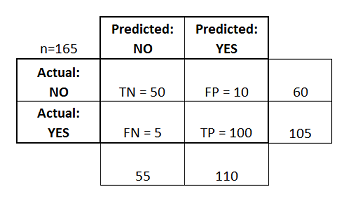

```{r setup, echo = FALSE}
knitr::opts_chunk$set(
  message = FALSE,
  fig.width = 10,
  fig.height = 4,
  comment = "#>",
  collapse = TRUE,
  warning = FALSE
)
```

## Classification

Email: Spam/Not Spam?

Online transactions: Fraudulent(Yes/No)?

Tumor: Malignant/Benign?

Loan Default: (Yes/No) 


$$
 y \in \{ 0,1 \} ~\left\{
    \begin{array}{ll}
        0 & \mbox{Negative class (e.g. able to pay loan)} \\
        1 & \mbox{Positive class (e.g. unable to pay loan)}
    \end{array}
\right.
$$
        
        
## Aims of this lesson 

Understand what a logistic regression is, how to prepare data for a logistic regression, and how to evaluate a model.

A logistic regression is a linear regression, applied to categorical outcomes by using a transformation function.

But, why do we need a transformation function, why not plain, old, linear regression?

We fit a simple linear model `default ~ balance` to the Default dataset from the `ISLR` package.


## Why do we need a transformation function?

Recall that: 

The linear regression model is nothing but the expected value of the target given the realisation of the predictors 
$$ \mathbb{E}\left(Y| X=x \right) = \beta^TX$$
Since  $Y$  is limited to values of  $0$  and  $1$ , we have

$$ \mathbb{E}\left(Y| X=x \right) =  P\left(Y| X=x \right)$$

It would then seem reasonable that $\beta^TX$  is a reasonable estimate of  $P\left(Y| X=x \right)$ . We test this on the __Default__ data.

## Why do we need a transformation function?

```{r, echo=FALSE}
library(ISLR)
library(tibble)
set.seed(42)
default_index = sample(nrow(Default), 5000)
default_train = Default[default_index, ]; default_test = Default[-default_index, ]
default_train_lm = default_train ; default_test_lm = default_test
default_train_lm$default = as.numeric(default_train_lm$default) - 1 
default_test_lm$default = as.numeric(default_test_lm$default) - 1
```

```{r}
model_lm = lm(default ~ balance, data = default_train_lm)
```
Everything seems to be working, until we plot the results.


```{r, echo=FALSE}
plot(default ~ balance, data = default_train_lm, 
     col = "darkorange", pch = "|", ylim = c(-0.2, 1),
     main = "Using linear regression for classification")
abline(h = 0, lty = 3)
abline(h = 1, lty = 3)
abline(h = 0.5, lty = 2)
abline(model_lm, lwd = 3, col = "dodgerblue")
```


## Why do we need a transformation function?

Two issues arise. First, all of the predicted probabilities are below 0.5 That means, we would classify every observation as a "No Default". This is certainly possible, but not what we would expect.

```{r}
all(predict(model_lm) < 0.5)
```
The next, and bigger issue, is predicted probabilities less than 0.
```{r}
any(predict(model_lm) < 0)
```


## Which transformation function?

+ The linear hypothesis $Y = h_{\beta}(X)= \beta^TX$ may take values from $-\infty$ to $\infty$   

+ We want $0 \leq  h_{\beta}(X)\leq 1$ 

+ $h_{\beta}(X)= g(\beta^TX)$ and $g(z) = \frac{1}{1+e^{-z}}$

+ Called Sigmoid or Logistic function 

<div align="center">
  
</div>


## Fitting the logistic model 

+ The model is fit by numerically maximizing the likelihood.

```{r}
model_glm = glm(default ~ balance, data = default_train, family = "binomial")

```


First, we can obtain the fitted coefficients the same way we did with linear regression.


```{r}
coef(model_glm)

```

```{r}
head(predict(model_glm))
```


The next thing we should understand is how the `predict()` function works with `glm()`. So, let's look a some predictions.

## How the `predict()` function works

By default, predict.glm() uses type = "link".

```{r}
head(predict(model_glm, type = "link"))
```

That is, `R` is returning 

$$\hat{\beta_0} + \hat{\beta_1}x_1 + \hat{\beta_1}x_1 + \hat{\beta_2}x_2+ \cdots+ \hat{\beta_p}x_p$$
for each observation.

These are not predicted probabilities. To obtain the predicted probabilities 

$$\hat{p}(x)=\hat{P}\left(Y=1 || X=x \right)$$

## How the `predict()` function works 

```{r}
head(predict(model_glm, type = "response"))
```

Note that these are probabilities, __not__ classifications. To obtain classifications, we will need to compare to the correct cutoff value with an `ifelse()` statement.

```{r}
model_glm_pred = ifelse(predict(model_glm, type = "link") > 0, "Yes", "No")
# model_glm_pred = ifelse(predict(model_glm, type = "response") > 0.5, "Yes", "No")

```
Once we have classifications, we can calculate metrics such as accuracy.

```{r}
mean(model_glm_pred == default_train$default) # train accuracy

```


## Confusion matrix  

<div align="center">
  
</div>

__true positives (TP)__: These are cases in which we predicted yes (Defalut), and they are Defaulted.

__true negatives (TN):__ We predicted will NOT default,  but they will NOT default.

__false positives (FP):__ We predicted Defaulted, but they don't actually Defaulted. (Also known as a "Type I error.")

__false negatives (FN):__ We predicted NOT Defaulted, but they actually do NOT Defaulted. (Also known as a "Type II error.")


## Other performance metrics 

__Accuracy:__ Overall, how often is the classifier correct?
  
 + $\frac{TP+TN}{\mbox{total}} = \frac{100+50}{165} = 0.91$ 

__Misclassification rate:__ Overall, how often is it wrong?
 
 + $\frac{FP+FN}{\mbox{total}} = \frac{(10+5)}{165} = 0.09$ 

 + equivalent to 1 minus Accuracy also known as _error rate_
 
__True positive rate:__ When it's actually yes, how often does it predict yes?

 + $\frac{TP}{\mbox{actual yes}} = \frac{100}{105} = 0.95$  also known as _Sensitivity_ or _Recall_
 

## Other performance metrics 

__False Positive Rate__: When it's actually no, how often does it predict yes?

$\frac{FP}{\mbox{actual no}} = \frac{10}{60} = 0.17$

__Specificity:__ When it's actually no, how often does it predict no?

$\frac{TN}{\mbox{actual no}} = 50/60 = 0.83$ equivalent to 1 minus False Positive Rate

__Precision:__ When it predicts yes, how often is it correct?

$\frac{TP}{\mbox{predicted yes}} = 100/110 = 0.91$

For more performance metrics take a look at the [InformationValue R package](http://bit.ly/1hJ6scb)   

## Back to our Default model 

Let calculate some metrics such as accuracy.

```{r}
mean(model_glm_pred == default_train$default) # train accuracy
```

We may use the `table()` and `confusionMatrix()` functions can be used to quickly obtain many more metrics.

```{r}
train_tab = table(predicted = model_glm_pred, actual = default_train$default)
library(caret)
train_con_mat = confusionMatrix(train_tab, positive = "Yes")
c(train_con_mat$overall["Accuracy"], 
  train_con_mat$byClass["Sensitivity"], 
  train_con_mat$byClass["Specificity"])
```


## Why the logistic model is better

```{r, echo=FALSE}
plot(default ~ balance, data = default_train_lm, 
     col = "darkorange", pch = "|", ylim = c(-0.2, 1),
     main = "Using Logistic regression for classification")
abline(h = 0, lty = 3)
abline(h = 1, lty = 3)
abline(h = 0.5, lty = 2)
curve(predict(model_glm, data.frame(balance = x), type = "response"), 
      add = TRUE, lwd = 3, col = "dodgerblue")
abline(v = -coef(model_glm)[1] / coef(model_glm)[2], lwd = 2)
```

- The blue "curve" is the predicted probabilities given by the fitted logistic regression: 
$$
\hat{p}({\bf x}) = P\left(Y = 1 \mid {\bf X = x}\right)
$$

## Why the logistic model is better

- The solid vertical black line represents the **[decision boundary](http://bit.ly/2pf9uJY)**, the `balance` that obtains a predicted probability of 0.5. In this case `balance` = `r -coef(model_glm)[1] / coef(model_glm)[2]`.

$$
\hat{p}({\bf x}) = \hat{P}[Y = 1 \mid {\bf X = x}] = 0.5
$$
Or
$$
\hat{\beta}_0 + \hat{\beta}_1 x_1 = 0.
$$
Thus, for logistic regression with a single predictor, the decision boundary is given by the *point* $x_1 = \frac{-\hat{\beta}_0}{\hat{\beta}_1}$


## Receiver Operating Characteristic (ROC)

+ Recall In our simple model above we classified _Defaulted_ vs _NOT Defaulted_ based on a probability threshold/cutoff of _Default_ equal to  $\theta =0.5$.

+ The choice of of this threshold impacts the values of all performance metrics, in particular the false positives (FP) and false negatives (FN).

+ For the purpose of visualizing and quantifying the impact of a threshold on the FP/FN-trade-off the ROC curve was introduced.

$$ROC_x(\theta) = FPR(\theta)= \frac{FP(\theta)}{FP(\theta)+TN(\theta)}=  \frac{FP(\theta)}{ \#N}$$
$$ROC_y(\theta) = TPR(\theta)= \frac{TP(\theta)}{FN(\theta)+TP(\theta)}=  \frac{TP(\theta)}{\#P}$$

## Receiver Operating Characteristic (ROC)

```{r, echo=FALSE}
source("calculate_roc.R")
source("plot_roc.R")
predictions <- data.frame(cbind(as.numeric(default_train$default) - 1 ,predict(model_glm, type = "response")))
names(predictions) <- c("default", "pred")


roc         <- calculate_roc(predictions, 1, 2, n = 100)
plot_roc(roc, 0.7, 1, 2)
```

+ The dashed lines indicate the location of the (FPR, TPR) corresponding to a threshold of 0.7.

## Receiver Operating Characteristic (ROC)

+ The low corner (0,0) is associated with a threshold of 1 and the top corner (1,1) with a threshold of 0.

+ The cost function and the corresponding coloring of the ROC points illustrate that an optimal FPR and TPR combination is determined by the associated cost.

+ Depending on the use case false negatives might be more costly than false positive or vice versa. Here I assumed a cost of 1 for FP cases and a cost of 2 for FN cases.


 
## Summary

+ Linear regression models are not suitable for classification problems. 

+ The linear assumption can be replaced buy the logistic function to avoid the linear assumption shortcomings

+ Most of statistical methods (RSS, p-values, dimension reduction, subsets selection, ridge, lasso, etc.) applied to the linear regression models remains valid for the logistic model. 

+ New classification performance metrics are used to assess the discrimination power of the logistic model  


# Thank you!

* Slides:  <http://bit.ly/2q9NPSU>
* GitHub:  <https://github.com/trefoil-ml>
* Twitter: <https://twitter.com/trefoilML>
* Email:   info@tridata.nl  or hzmarrou@gmail.com

