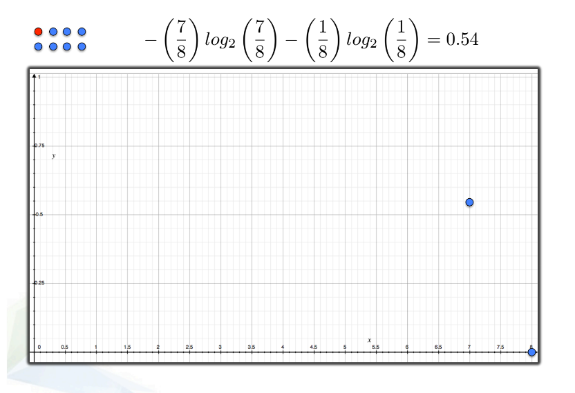
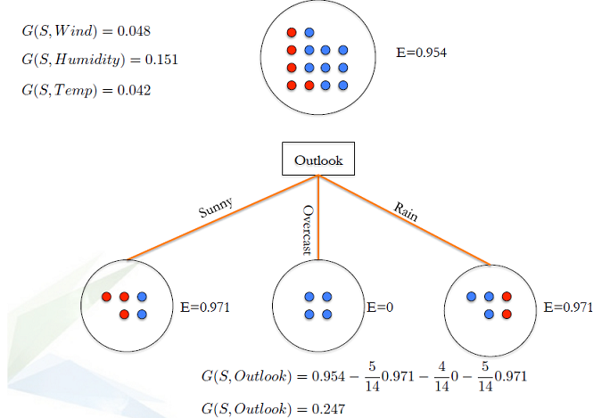
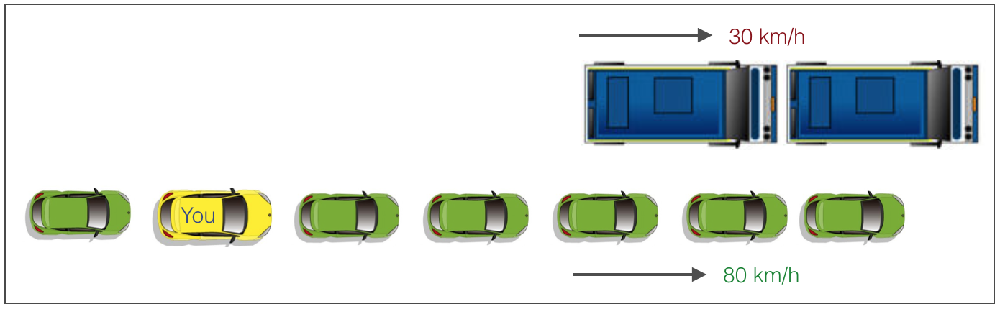

```{r setup, echo = FALSE}
knitr::opts_chunk$set(
  message = FALSE,
  fig.width = 10,
  fig.height = 4,
  comment = "#>",
  collapse = TRUE,
  warning = FALSE
)
```


        
        
## Aims of this lesson 

+ Understand what are  decision trees and random forests , how they works, and how to evaluate  a DT or a RF model.

+ Decision tree is a type of supervised learning algorithm (having a pre-defined target variable)  mostly used in classification problems. 

+ It works for both categorical and continuous input and output variables. 

+ In this technique, we split the population or sample into two or more homogeneous sets (or sub-populations) based on most significant splitter / differentiator in input variables.

# Decision trees

##  Example  

<div align="center">
   
</div>


## Example 

<div align="center">
   
</div>

## Example 

<div align="center">
   
</div>

## Example 

<div align="center">
   
</div>


## Example 

<div align="center">
   
</div>

## Example 

<div align="center">
   
</div>


## Types of decision trees

+ __Classification decision tree:__ Decision trees which have categorical target variable

    + Models suitable for answering questions: Which category(ies)  


+ __Regression trees:__ decision trees that have continuous target variable 

    + Models suitable for answering questions: How mach, how many 
     
##  Terminology related to decision trees
 
1. __Root Node:__ It represents entire population or sample and this further gets divided into two or more homogeneous sets.

2. __Splitting:__ It is a process of dividing a node into two or more sub-nodes.

3. __Decision Node:__ When a sub-node splits into further sub-nodes, then it is called decision node.

4. __Leaf/ Terminal Node:__ Nodes do not split is called Leaf or Terminal node.

5. __Pruning:__ When we remove sub-nodes of a decision node, this process is called pruning. You can say opposite process of splitting.

6. __Branch / Sub-Tree:__ A sub section of entire tree is called branch or sub-tree.

7. __Parent and Child Node:__ A node, which is divided into sub-nodes is called parent node of sub-nodes where as sub-nodes are the child of parent node.


##  Terminology related to decision trees
<div align="center">
   
</div>

## Advantages & disadvantages

### Advantages 


+ Easy to Understand:

+ Useful in data exploration: 

+ Less data cleaning required.

+ Data type is not a constraint.

+ Non parametric method.


### Disadvantages

+ Over fitting

+ Not fit for continuous variables


## How does a tree decide where to split?

<div align="center">
   
</div>


## How does a tree decide where to split?

<div align="center">
   
</div>

## How does a tree decide where to split?

<div align="center">
   
</div>

## How does a tree decide where to split?

<div align="center">
   
</div>

## How does a tree decide where to split?

<div align="center">
   
</div>

## How does a tree decide where to split?

<div align="center">
   
</div>

## How does a tree decide where to split?

<div align="center">
   
</div>

## How does a tree decide where to split?

<div align="center">
   
</div>

## How does a tree decide where to split?

<div align="center">
   
</div>

## How does a tree decide where to split?

<div align="center">
   
</div>


## How does a tree decide where to split?

<div align="center">
   
</div>

## How does a tree decide where to split?

<div align="center">
   
</div>

## How does a tree decide where to split?

<div align="center">
   
</div>


## How does a tree decide where to split?

<div align="center">
   
</div>

## How does a tree decide where to split?

<div align="center">
   
</div>

## How does a tree decide where to split?

<div align="center">
   
</div>

## How does a tree decide where to split?

<div align="center">
   
</div>


## How does a tree decide where to split?

<div align="center">
   
</div>


## How does a tree decide where to split?

<div align="center">
   
</div>


## key parameters of tree modeling

+ Overfitting is one of the key challenges faced while modeling decision trees. 

+ If no limit set,  tree give you 100% accuracy on training set

+ Preventing overfitting is essential in fitting  a decision tree and it can be done in 2 ways:

    * Setting constraints on tree size
    * Tree pruning

## Setting constraints on tree size

<div align="center">
   
</div>


## Setting constraints on tree size

1. Minimum samples for a node split (`min_samples_split`)

    + Control over-fitting. Should be tuned using CV.

2. Minimum samples for a terminal node (leaf)

    + Control over-fitting similar to min_samples_split.

3. Maximum depth of tree (vertical depth, `max_depth`)

    + Control over-fitting Should be tuned using CV
    
4. Maximum number of terminal nodes
    
    + Can be defined in place of `max_depth`. In a binary tree, a depth of 'n' would produce a maximum of $2^{n+1} -1$ leaves.

5. Maximum features to consider for split

## Tree pruning
<div align="center">
   
</div>

1. A lane with cars moving at 80km/h
2. A lane with trucks moving at 30km/h

At this instant, you are the yellow car and you have 2 choices:

1. Take a left and overtake the other 2 cars quickly
2. Keep moving in the present lane


## Tree pruning

1. Make the decision tree to a large depth.

2. Start at the bottom and start removing leaves which are giving us negative IG when compared from the top.


Suppose a split is giving us a gain of say -10 (loss of 10) and then the next split on that gives us a gain of 20. A simple decision tree will stop at step 1 but in pruning, we will see that the overall gain is +10 and keep both leaves.


## Are tree based models better than logistic  models?

+ If the relationship between dependent & independent variable is well approximated by a linear model, linear regression will outperform tree based model.

+ If there is a high non-linearity & complex relationship between dependent & independent variables, a tree model will outperform a classical regression method.

+ If you need to build a model which is easy to explain to people, a decision tree model will always do better than a linear model. Decision tree models are even simpler to interpret than linear regression!

## Working with decision trees in R

```{r }
library(rpart)
set.seed(9850) 
idxr  <- runif(nrow(iris))
irisr <-iris[order(idxr),]
miris <- rpart(Species ~., data = irisr[1:100,],control = rpart.control(cp=0.005, xval=10, maxdepth=5))
miris

```

$cp$ is the complexity parameter, see `help(rpart.control)` 


## how to read the output?

node), split, n, loss, yval, (yprob)

1.  node): indicates the node number; 2.  split: indicates the split criterion

3.  n: indicates the number of individuals in the groupe

4.  loss: indicates the the number of individuals misclassified

5.   yval: indicates the predicted value

6.  (yprob): indicates the probability of belonging to each class    
    


__Note:__ when you fit a tree using `rpart`, the fitting routine automatically  performs `10-fold CV` and stores the errors for later use  (such as for pruning the tree)


## how to read the output?


```{r}
library(rpart.plot)
rpart.plot(miris)

```


## how to read the output?

```{r}

rpart.plot(miris, type = 3)

```

## how to read the output?

```{r}
library(rattle)
library(RColorBrewer)
fancyRpartPlot(miris)

```

## how to read the output?

```{r}
summary(miris)
```

## Use the model to predict the class/category of new data 

```{r}
piris <- predict(miris, irisr[101:150,], type = "class")
table(irisr[101:150,5],piris)
```

## Tuning the parameters   

```{r}
plotcp(miris)
min_cp = miris$cptable[which.min(miris$cptable[,"xerror"]),"CP"] # find best value of $cp$
min_cp

```


## Prune the tree using complexity parameter

```{r}
# prunce tree using best cp
miris_prune = prune(miris, cp = min_cp)

rpart.plot(miris_prune)
```

# Ensemble methods - Random Forests 

## What are ensemble methods in tree based modeling ?

__en-sem-ble__

A unit or group of complementary parts that contribute to a single effect, especially:

 * A coordinated outfit or costume.

 * A coordinated set of furniture.

 * A group of musicians, singers, dancers, or actors who perform together


## Summary


## References 

[An Introduction to Recursive Partitioning Using the rpart Routines](http://bit.ly/2oQiao8) - Details of the rpart package.
rpart.plot Package - Detailed manual on plotting with rpart using the rpart.plot package.

# Thank you!

* Slides:  <http://bit.ly/2q9NPSU>
* GitHub:  <https://github.com/trefoil-ml>
* Twitter: <https://twitter.com/trefoilML>
* Email:   info@tridata.nl  or hzmarrou@gmail.com

