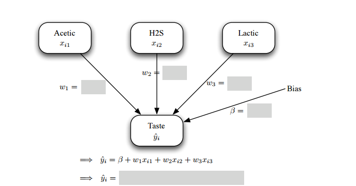
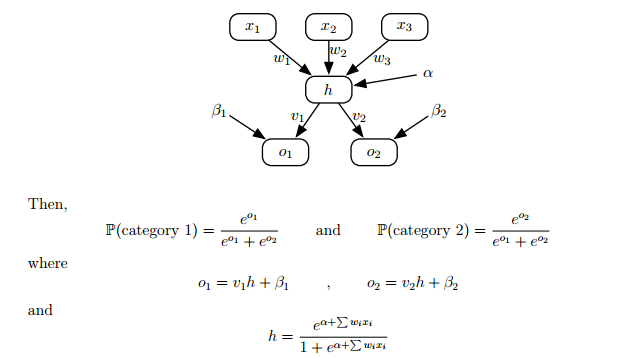

<hr>

[Visit my website](http://trefoil.ml/) for more like this!

__References__

Most of this material is borrowed from:

* Textbook: [Introduction to statistical learning](http://www-bcf.usc.edu/~gareth/ISL/) Chapter 8

______________________________________________________________________________________________________________________________________

  
## Random Forest

### Fitting the model  


1. Read in the German credit data and create a $\frac{2}{3}:\frac{1}{3}$ train:test split (Hint use the `sample` function or the `createDataPartition` function from the `caret` package) 


2. Load the `RandomForest` package which contains the functions to build regression and classification trees in R.

3. Fit a random forest model to the data set. 

4. Look at `help(tuneRF)` and figure out how to use it to fit a tree where the number of variables randomly sampled as candidates at each split is automatically tuned. (Hint: you don't specify a formula here ... just pass the correct columns of the train matrix for x and y and have a look at the doBest option)


```{r}
#########
set.seed(1)
creditdata <- read.csv("./data/creditdata.csv") 
n      <- nrow(creditdata)
idx    <- sample(n, size = trunc(0.70 * n))
train  <- creditdata[idx, ]
nlearn <- length(creditdata) 
test   <- creditdata[-idx, ]
ntest  <- n - nlearn

########
creditdata$good_bad <- credit$Creditability

levels(creditdata$good_bad) = c("0", "1")
library(randomForest)
fit = randomForest(good_bad ~ ., data=train, ntree=500,importance=TRUE, proximity=TRUE)
fit
```


### Variable importance


4. Use the the function `importance` from the same package to print the importance of the variable in the model, use the `help` function to read more details about the output of this function 

5. Use the the function `varImpPlot` to plot the  importance of the variable in the model

#### Partial importance 


Digging deeper than just which variable is important, we can actually examine the effect of different values of a given variable on the class prediction. In other words, we saw that under the mean decrease in Gini measure, the purpose of the loan was relatively high importance as a variable - but, what is the effect of the different loan purposes (car/furniture/etc) on the probability of default on the loan? 

6. uRSS the function `partialPlot`  to extract (plot) the marginal effect that each category of the loan purpose variable has on the probability of being claRSSd as a _good_ credit risk


7. If you are aRSSssing the risk of a borrower who wants a loan for a car and you learn that the car is used, then considering only the marginal effect are you more likely to rate them as a good credit risk than if they had told you they were borrowing to buy a new car? (Hint: You might need to look up the meaning of codes A-J from the PDF file on the course website)

8. Do a partial dependence plot for the marginal effect that the age variable has on the probability of being claRSSd as a good credit risk. Note the interesting features of the plot, including the rapid increase in credit worthiness through the 20s and the rapid drop-off after retirement age.
 
 
 

```{r}
importance(fit)
varImpPlot(fit)
partialPlot(fit, test, purpose, "Good")
partialPlot(fit, test, age, "Good")

```


###  Other Model Evaluation

8. Compute the confusion matrix for the classifier you have created.


9. Compute the ROC curve for the classifier you have created.

> Note: by default, using predict() on a random forest just returns the predicted claRSSs and not the probabilities. Look at
  ?predict.randomForest to figure out how to get the probabilities instead.


## Neural networks 
### Regression

1. Load the cheese data into a variable called cheese in your workspace.

```{r}
cheese <- read.csv("./data/cheese.csv")
```


2. Load the nnet package, which contains the functions to build neural networks in R.

3. We are going to first fit the simplest possible neural network to the cheese data, to predict taste from acetic, H2S and lactic. This is the neural network with the input layer directly connected to the output.

```{r}
fitnn1 = nnet(taste ~ Acetic + H2S + Lactic, cheese, size=0, skip=TRUE, linout=TRUE)

 summary(fitnn1)

```


* The size argument specifies how many nodes to have in the hidden layer, skip indicates that the input layer has a direct connection to the output layer and linout specifies the simple identity activation function.

* The output from summary gives us the detail of the neural network. i1, i2 and i3 are the input nodes (so acetic, H2S and lactic respectively); o is the output node (so taste); and b is the bias.

4. Fill in the shaded boxes on the neural network diagram below with the values
which R has fitted.

<div align="center">
   
</div>


5. Compare this to the fit we get by doing standard least squares regression:

```{r}
lm(taste ~ Acetic + H2S + Lactic, cheese)

```
Upto a reasonable level of accuracy, do you see any difference between the linear model and neural network fit?

6. Use the formula hereunder to compute the Akaike Information Criterion (AIC) and Schwarz Bayesian Information Criterion (BIC) and evaluate this version of the model

$$
AIC = 2k + n \log(\frac{RSS}{n}) \\
BIC  = k\log(n)+n \log(\frac{RSS}{n})
$$

where $k$ is the number of parameters being estimated, $n$ is the number of observations in the full data set and $RSS = \sum \epsilon_i = \sum(\hat{y_i}-y_i)^2$


```{r}
 RSS1 = sum(fitnn1$residuals^2)
 AIC1 = 2*5 + 30*log(RSS1/30)

```


7. Using the $RSS$ already calculated in $RSS1$, compute the $BIC$ and store it in a variable called $BIC1$

8. An analyst working on the project may believe there is reason to query whether acetic is a good linear predictor for taste. To test this conjecture, we can refit a linear model without acetic in and compare the AIC and SBIC of the two models.

```{r } 
fitnn2 = nnet(taste ~ H2S + Lactic, cheese, size=0, skip=TRUE, linout=TRUE)
summary(fitnn2)
RSS2 = sum(fitnn2$residuals^2)
AIC2 = 2*4 + 30*log(RSS2/30)
AIC2
AIC2 < AIC1
```

#### Adding a Hidden Layer With a Single Node
9. add a hidden layer with single node 

```{r}
fitnn3= nnet(taste ~ Acetic + H2S + Lactic, cheese, size=1,linout=TRUE)
summary(fitnn3)
```
The numbers being printed here are the  $RSS = \sum \epsilon_i = \sum(\hat{y_i}-y_i)^2$ for the fit on the current iteration of the neural network fitting algorithm. If you look back to the previous nnet() calls, you should see that the final $RSS ??? 2700$. It seems very  that the $RSS$ hasn't improved dramatically when we are increasing the model complexity! The writers of `nnet()` have designed the algorithm to be more robust to this kind of issue when scaled data is used $(mean({xi}) = 0, s_{xi}^2 = 1$).
So, we'll scale the data and refit:


```{r}
cheese2 = scale(cheese)
fitnn4  = nnet(taste ~ Acetic + H2S + Lactic, cheese2, size=1, linout=TRUE)
summary(fitnn4)
```

10. draw the full neural network we have fitted. Make sure you show all appropriate connections; all the weights for every connection; and write the full model equation after the diagram.


### Classification

1. Load the `clean_titanic.csv` data into a variable called data in your workspace and get rid of the column `name`

2. Split the data in data into two variables, one called train and another called test. The split should be 1/3 for the testing data and 2/3 for the training data and check that there are a decent number of survivors and non-survivors in
both train and test.

```{r}
set.seed(1)
n      = nrow(clean_titanic)
idx    = sample(n, size = trunc(0.66 * n))
train = clean_titanic[idx, ]
test = clean_titanic[-idx, ]

```


3. The nnet package has a slightly strange requirement that the target variable of the classification (ie survived) be in a particular format. At the moment, if you look at data$survived you will see it is a vector of 0/1 values, but when using nnet() for classification we must instead provide a two-column matrix.

```{r}
train$surv = class.ind(train$survived)
test$surv = class.ind(test$survived)

```

Now fit a neural network for classification purposes based om the `age+sex+pclass`


```{r}
fitnn = nnet(surv~sex+age+pclass, train, size=1, softmax=TRUE)
fitnn
summary(fitnn)

```

4. Draw the neural network below. Remember to label each node carefully (particularly pay attention to the fact we have categorical nodes here) and label every arc with the weights


5. Look at the overall performance of the neural network by looking at a table of how predictions using the test set fare:

```{r}
table(data.frame(predicted=predict(fitnn, test)[,2] > 0.5, actual=test$surv[,2]>0.5))
```

How do you think it is doing?


### Calculating Probabilities

Calculating the probabilities from the neural network can seem a bit difficult, so we recap how the nnet function is doing it (which might be subtly different from lectures, but you should see the high-level similarity). Consider the following example of a classification neural network:


<div align="center">
   
</div>


5. Using the neural network you drew above, manually calculate the probability that an adult female passenger in first class does not survive


## Comparing and Contrasting


You should have seen enough R now that you can build classification trees, neural networks and random forests for different classification problems. Therefore, we can explore these three techniques using the German credit risk data
as the subject. 

  First, some things to bear in mind:

*  Fit each model on the same training data so that you can directly compare the results you are getting. Don't just run the fitting command and forget it, but look at the output and make sure it is making sense.
You might have to tune things (eg decay for neural networks).

* Store each model in different variables. In other words, don't just use `fit`, but use `fittree`, `fitnn` and `fitrf` so that you can work with all at once.

* If you want to compare plots side-by-side, remember the handy preplotting command `par(mfrow=c(1,3))` or use `multiplot.R`function in the courses folder to do so.. The 1 is the number of rows and 3 the number of columns for the grid of plots: vary these as needed.


  Use the German credit data as a data set with which to compare all the approaches to classification you have learned on the   course. Let your imagination run wild! Some ideas to get you started (each progressively harder)

1. Compare the confusion matrices for each technique

2. See which technique gives the most convincing model evaluation plots [(ROC) curve](http://jkunst.com/riskr/) 

3. If you were writing a program to perform classification on data arriving in real time, then speed of fitting and predicting may be an issue. Explore the system.time() command to compare the run-time of the different models.

4.  We didn't explore varying the number of trees in our forest. Try out a for-loop to fit a forest of 100 to 1,000 trees in steps of 100 and plot the overall misclassification rate on the test data against forest size

5. All the techniques allow tweaking how hard we penalise false positives or false negatives by adjusting where we take the probability cut-off (by default 0.5). Think about how a lender might setup the problem to minimise loRSSs as a result of misclassification by adjusting the cut-off in each method.

    For example, imagine a new loan is being aRSSRSSd and in this scenario the person defaulting on the loan may cost the         lender e 1,000 whereas turning down a person who would pay loses them e 600 in charges. 
    
    For all three techniques, tune the cut-off on the train data and see how much would be lost by the lender through the two     types of misclassification when applied to the test set. Which classifier is best in this scenario?

6.  Random forests are based on the idea of building a more powerful classifier from many smaller ones. We can do likewise! Build your own new classifier which is a model averaging of a tree, a neural network and a random forest.

    In other words, a classifier which predicts class membership probabilities as the average of the class probabilities given     by each of the three techniques. Test your classifier using confusion matrices, ROC curves etc and compare it to the three     individual models. A step up from this is weighted averaging where the weights could be chosen to max/min-imise some          criterion.


