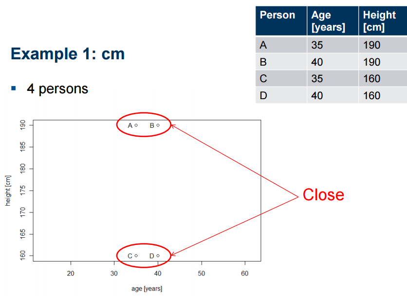
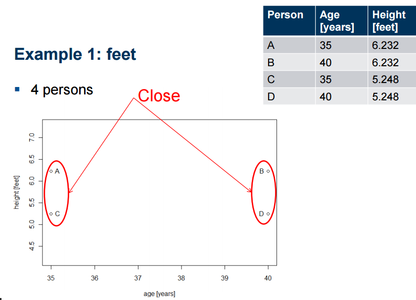
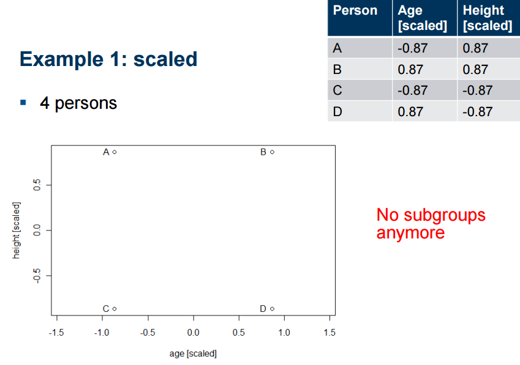
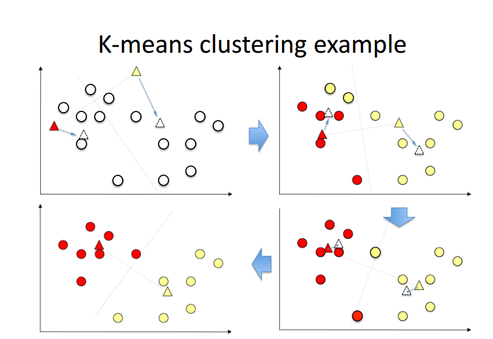
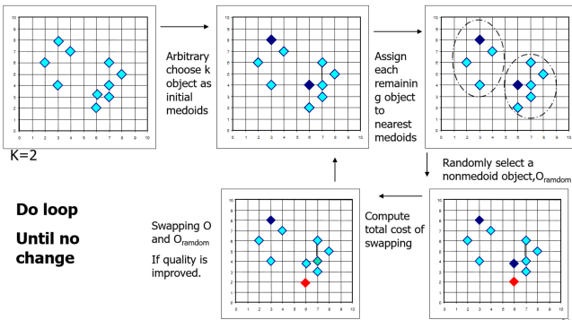
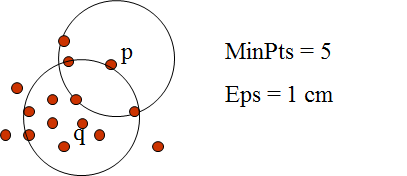
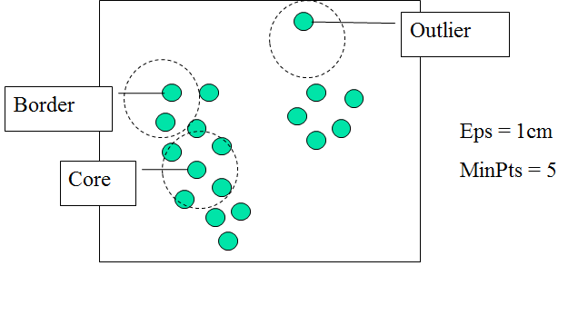

```{r setup, echo = FALSE}
knitr::opts_chunk$set(
  message = FALSE,
  fig.width = 10,
  fig.height = 4,
  comment = "#>",
  collapse = TRUE,
  warning = FALSE
)
```


        
## Aims of this lesson 

+ Introduce you to the clustering algorithms and evaluation

+ Give some application examples 


# Clustering algorithms

## Introduction

+ unsupervised machine learning algorithms. Why unsupervised ?

+ The model is trained based on given input variables which attempt to discover intrinsic groups (or clusters). 

+ Clustering algorithms are widely used across all industries such as retail, banking, manufacturing, healthcare, etc. 

+ Separate customers sharing similar characteristics. 

+ Extract abnormal observations

##  Table of Contents

1. Types of clustering techniques
2. Distance calculation for clustering
3. K-means clustering | How does it works?
4. How to select the best value of k in k means?
5. K-medoids clustering | how it works
6. DBSCAN
7. Model based clustering models

## Types of Clustering Techniques

+  Many types of clustering algorithms exist.

Among these different clustering algorithms, there exists clustering behaviors known as

+ Model based lustering: In this technique, the probability or likelihood of an observation being partitioned into a cluster is calculated.

+ Non-parametric clustering: an observation is partitioned into exactly one cluster (no probability is calculated).

## Distance calculation for clustering

1. Distance calculations for quantitative variables are highly influenced by variable units and magnitude. Standardize!

2. Use of a particular distance measure depends on the variable types.

Suppose, we are given a 2-dimensional data with 

$$X = (x_1, x_2,\cdots,x_p)$$ 
and 
$$Y = (y_1, y_2, \cdots, y_p)$$
We can calculate various distances as follows:


## Distance calculation for clustering

### Numeric variables

* Euclidean Distance: $d(X,Y) = \sum (x_i -y_i)^2$

* Manhattan Distance: $d(X,Y) = \sum |x_i -y_i|$     


### Catergorical variables 

Hamming Distance: $d(x, y) = \sum(x_i \neq  y_i)$


### Mixed variables

* Gower Distance

* Cosine Similarity 

 
## Distance calculation for clustering

### Cosine Similarity 

1. `Julie loves me more than Linda loves me`

2. `Jane likes me more than Julie loves me`

List of the words from both texts

`me Julie loves Linda than more likes Jane`

```
words         frequency 1      frequency 2  
--------------------------------------------
me                2                2   
Jane              0                1 
Jullie            1                0
Linda             0                1
likes             0                1
loves             2                1  
more              1                1
than              1                1  
```
## Distance calculation for clustering

### Cosine Similarity 

The two vectors are, again:

```
a: [2, 1, 0, 2, 0, 1, 1, 1]

b: [2, 1, 1, 1, 1, 0, 1, 1]
```

$$ \text{cos-similarity}(X,Y) = \cos(X, Y) = \frac{X . Y}{||X||.||Y||} $$

The cosine of the angle between $a$ and $b$ is about 0.822.


## Why Standardization?
 
 <div align="center">
   
</div>


## Why Standardization?
 
 <div align="center">
   
</div>

## Why Standardization?
 
 <div align="center">
   
</div>


## K-means clustering:  How does it work ?

* Input: $K$, set pf points $x_1,\cdots,x_n$

* Place random centroids $c_1,\cdots,c_k$ at random locations 

* Repeat until convergence: 
  
    + for each point $x_i$: 
        + find nearest centroid $c_j$ 
        + assign the point $x_i$ to cluster $c_j$
    + for each cluster $c_1,\cdots,c_k$    
        + compute new centroid $c_j =$ mean of all points $x_i$
        + assign the new centroid  to the cluster $j$ in the previous step 
        
* Stop when none of the cluster assignments change 

## K-means clustering:  How does it work ?

<div align="center">
   
</div>

## K-means clustering in R

```
kmeans(x, centers, iter.max = 10, nstart = 1)

x: numeric matrix, numeric data frame or a numeric vector
centers: Possible values are the number of clusters (k) or a set of initial cluster centers. 
iter.max: The maximum number of iterations allowed. Default value is 10.
nstart: The number of random starting partitions when centers is a number. 
```
kmeans() function returns a list including:

```
cluster: A vector of integers (1:k) indicating the cluster to which each point is allocated
centers: A matrix of cluster centers (cluster means)
totss: The total sum of squares (TSS) measures the total variance in the data.
withinss: Vector of within-cluster sum of squares, one component per cluster
tot.withinss: Total within-cluster sum of squares, i.e. sum(withinss)sum(withinss)
betweenss: The between-cluster sum of squares, i.e. totss???tot.withinsstotss???tot.withinss
size: The number of observations in each cluster

```


## K-means clustering in R


```{r}

set.seed(123)
# Two-dimensional data format
df <- rbind(matrix(rnorm(100, sd = 0.3), ncol = 2),
           matrix(rnorm(100, mean = 1, sd = 0.3), ncol = 2))
colnames(df) <- c("x", "y")
head(df)

```


## K-means clustering in R

The R code below performs k-means clustering with k = 2:

```{r}
# Compute k-means
set.seed(123)
km.res <- kmeans(df, 2, nstart = 25)
# Cluster number for each of the observations
km.res$cluster

```


```{r}
# Cluster size
km.res$size
# Cluster means
km.res$centers
```

## K-means clustering in R


It's possible to plot the data with coloring each data point according to its cluster assignment. The cluster centers are specified using "big stars":


```{r }
plot(df, col = km.res$cluster, pch = 19, frame = FALSE,
     main = "K-means with k = 2")
points(km.res$centers, col = 1:2, pch = 8, cex = 3)

```

## K-means clustering in R

```{r }
set.seed(123)
km.res <- kmeans(df, 4, nstart = 25)
plot(df, col = km.res$cluster, pch = 19, frame = FALSE,
     main = "K-means with k = 4")
points(km.res$centers, col = 1:4, pch = 8, cex = 3)
``` 


## K-means clustering in R

```{r}
# Print the result
km.res
```


## K-means clustering in R
A good k-means clustering is a one that minimize the total within-cluster variation  (i.e, the average distance of each point to its assigned centroid). For illustration, let's compare the results (i.e. tot.withinss) of a k-means approach with nstart = 1 against nstart = 25.
```{r}
set.seed(123)
# K-means with nstart = 1
km.res <- kmeans(df, 4, nstart = 1)
km.res$tot.withinss
```
```{r}
# K-means with nstart = 25
km.res <- kmeans(df, 4, nstart = 25)
km.res$tot.withinss
```


## Handeling ouliers: from K-means to K-medoids

* k-means clustering is highly sensitive to outliers. 

* Affects the assignment of observations to clusters. 

* A more robust algorithm is provided by PAM algorithm (Partitioning Around Medoids) which is also known as k-medoids clustering.

* K-Medoids:  Instead of taking the mean value of the object in a cluster as a reference point, medoids can be used, which is the most centrally located object in a cluster


## Handeling ouliers: from K-means to K-medoids

<div align="center">
   
</div>


## Handeling ouliers: from K-means to K-medoids

* K-Medoids Clustering: Find representative objects (medoids) in clusters
    
    + PAM (Partitioning Around Medoids, Kaufmann & Rousseeuw 1987)
    + Starts from an initial set of medoids and iteratively replaces one of the medoids by one of the non-medoids if it improves the total         distance of the resulting clustering
    + PAM works effectively for small data sets, but does not scale well for large data sets (due to the computational complexity)  
      Efficiency improvement on PAM
    + CLARA (Kaufmann & Rousseeuw, 1990): PAM on samples CLARANS (Ng & Han, 1994): Randomized re-sampling

## K-medoids in R 

The function `pam()` [in cluster package] and `pamk()` [in fpc package] can be used to compute PAM algorithm (Partitioning Around Medoids).

```
pam(x, k)

x: possible values includes:
Numeric data matrix or numeric data frame: each row corresponds to an observation, and each column corresponds to a variable.
Dissimilarity matrix: in this case x is typically the output of daisy() or dist()
k: The number of clusters

```


##  DBSCAN: density-based clustering

```{r, echo=FALSE}
library(factoextra)
data("multishapes")
multishapes$shape <- factor(multishapes$shape)
df <- multishapes[, 1:2]
set.seed(123)

ggplot(multishapes, aes(x=x, y=y, colour= shape)) + geom_point() 
```

##  DBSCAN: density-based clustering

> We know there are 5 five clusters in the data, but it can be seen that k-means method inaccurately identify the 5 clusters

```{r, echo=FALSE}
library(factoextra)
data("multishapes")
df <- multishapes[, 1:2]
set.seed(123)
km.res <- kmeans(df, 5, nstart = 25)
fviz_cluster(km.res, df, frame = FALSE, geom = "point")

```

##  DBSCAN: density-based clustering

* Unlike K-means, DBSCAN does not require the user to specify the number of clusters to be generated
* DBSCAN can find any shape of clusters. The cluster doesn't have to be circular.
* DBSCAN can identify outliers

<div align="center">
   
</div>

##  DBSCAN: density-based clustering


* Clusters are dense regions in the data space, separated by regions of lower density of points. 

* In other words, the density of points in a cluster is considerably higher than the density of points outside the cluster ("areas of noise").

* DBSCAN is based on this intuitive notion of "clusters" and "noise".

* The key idea is that for each point of a cluster, the neighborhood of a given radius has to contain at least a minimum number of points.


## Algorithm of DBSCAN

The goal is to identify dense regions, which can be measured by the number of objects close to a given point.

Two parameters are required for __DBSCAN__: __epsilon__ ("eps") and __minimum points__ ("MinPts").

* __eps__:  The parameter eps defines the radius of neighborhood around a point x. It's called called the $\epsilon$-neighborhood of x.

* __MinPts__: The parameter MinPts is the minimum number of neighbors within "eps" radius.

We define also: $N_{\epsilon}(q): \{ p \in D | dist(p,q) \leq \epsilon\}$

http://bit.ly/2qA8V0p

## Algorithm of DBSCAN

<div align="center">
       
</div>

## Algorithm of DBSCAN 

* Arbitrary select a point p

* Retrieve all points density-reachable from p w.r.t. Eps and MinPts

* If p is a core point, a cluster is formed

* If p is a border point, no points are density-reachable from p and DBSCAN visits the next point of the database

* Continue the process until all of the points have been processed

* If a spatial index is used, the computational complexity of DBSCAN is O(nlogn), where n is the number of database objects. Otherwise, the complexity is O(n2)

## DBSCAN in R 

Three R packages are be used:

* `fpc` and `dbscan` for computing density-based clustering
* `factoextra` for visualizing clusters

```
library(fpc)
library(dbscan)
dbscan(data, eps, MinPts = 5, scale = FALSE, 
       method = c("hybrid", "raw", "dist"))

data: data matrix, data frame or dissimilarity matrix (dist-object). Specify method = "dist" if the data should be interpreted as dissimilarity matrix or object. Otherwise Euclidean distances will be used.
eps: Reachability maximum distance
MinPts: Reachability minimum number of points
scale: If TRUE, the data will be scaled
method: Possible values are:
dist: Treats the data as distance matrix
raw: Treats the data as raw data
hybrid: Expect also raw data, but calculates partial distance matrices
     
```

## DBSCAN in R 

The result of the function fpc::dbscan() provides an object of class 'dbscan' containing the following components:

* cluster: integer vector coding cluster membership with noise observations (singletons) coded as 0
* isseed: logical vector indicating whether a point is a seed (not border, not noise)
* eps: parameter eps
* MinPts: parameter MinPts

Go to the exercises 


## Model-Based Clustering 

* The traditional clustering methods such as(k-means and others) are heuristic and are not based on formal models.

* Alternative is to use model-based clustering:  data are considered as coming from a distribution that is mixture of two or more components (i.e. clusters)

* Each component k (i.e. group or cluster) is modeled by the normal or Gaussian distribution which is characterized by the parameters:
    
    + $\mu_k$
    
    + $Cov_k$
    
    + An associated probability in the mixture. Each point has a probability of belonging to each cluster.
    
The key advantage of this approach, compared to the standard clustering is the suggestion of the number of clusters and an appropriate model.


## Model-Based Clustering 
```
+ The model parameters can be estimated using the EM (Expectation-Maximization) 
algorithm initialized.
+ Geometric features (shape, volume, orientation) of each cluster are determined 
by the covariance matrix.
+ Different possible parameterizations of Cov matrix are available in the R package `mclust`.
+ The available model options, in mclust package, are represented by identifiers including:
EII, VII, EEI, VEI, EVI, VVI, EEE, EEV, VEV and VVV.
+ The first identifier refers to volume, the second to shape and the third to orientation. 
E stands for "equal", V for "variable" and I for "coordinate axes".

For example:
+EVI denotes a model in which the volumes of all clusters are equal (E), 
the shapes of the clusters may vary (V), and the orientation is the 
identity (I) or "coordinate axes.
+ EEE means that the clusters have the same volume, shape and orientation in 
p-dimensional space.
+ VEI means that the clusters have variable volume, the same shape and 
orientation equal to coordinate axes.
```

## Model-Based Clustering 

We'll use the bivariate faithful data set which contains the waiting time between eruptions and the duration of the eruption for the Old Faithful geyser in Yellowstone National Park (Wyoming, USA).

```{r, echo=FALSE}
# Load the data
data("faithful")
# head(faithful)
library("ggplot2")
ggplot(faithful, aes(x=eruptions, y=waiting)) +
  geom_point() +  # Scatter plot
  geom_density2d() # Add 2d density estimation
```

## Model-Based clustering in R 

The function `Mclust()` [in `mclust` package] can be used to compute model-based clustering.

```{r, echo=FALSE}
# Install if needed
# install.packages("mclust")
# Load
library("mclust")
```
The function`Mclust()` provides the optimal mixture model estimation according to `BIC`. A simplified format is:

```
Mclust(data, G = NULL)

data: A numeric vector, matrix or data frame. Categorical variables are not allowed. 
      If a matrix or data frame, rows correspond to observations and columns 
      correspond to variables.
G: An integer vector specifying the numbers of mixture components (clusters) for which 
   the BIC is to be calculated. The default is G=1:9.
```

## Model-Based clustering in R 


The function `Mclust()` returns an object of class `Mclust` containing the following elements:

```
modelName: A character string denoting the model at which the optimal BIC occurs.
G: The optimal number of mixture components (i.e: number of clusters)
BIC: All BIV values
bic Optimal BIC value
loglik: The loglikelihood corresponding to the optimal BIC
df: The number of estimated parameters
Z: A matrix whose [i,k]th[i,k]th entry is the probability that observation ii in 
   the test data belongs to the kthkth class. Column names are cluster numbers, and rows are observations
   classification: The cluster number of each observation, i.e. map(z)
uncertainty: The uncertainty associated with the classification
```

## Model-Based clustering in R 

```{r}
library(mclust)
# Model-based-clustering
mc <- Mclust(faithful)
# Print a summary
summary(mc)
```

## Model-Based clustering in R 

Values returned by Mclust()

```{r}
names(mc)
```

## Model-Based clustering in R 

We can also print Optimal selected model

```{r}
# Optimal selected model
mc$modelName
```

and the optimal number of clusters

```{r}
# Optimal number of cluster
mc$G

```

and the probality for an observation to be in a given cluster


## Model-Based clustering in R 

```{r}
head(mc$z)
```
and the cluster assignement of each observation

```{r}
head(mc$classification, 10)
``` 

## Model-Based clustering in R 

 Uncertainty associated with the classification
```{r}
# Uncertainty associated with the classification
head(mc$uncertainty)
```

Model-based clustering results can be drawn using the function plot.Mclust():
```
plot(x, what = c("BIC", "classification", "uncertainty", "density"),
     xlab = NULL, ylab = NULL, addEllipses = TRUE, main = TRUE, ...)
```

```{r}
# BIC values used for choosing the number of clusters
plot(mc, "BIC")
```


## Model-Based clustering in R 

Classification: plot showing the clustering

```{r}
plot(mc, "classification")
```


and the lassification uncertainty

## Model-Based clustering in R 

```{r}
# Classification uncertainty
plot(mc, "uncertainty")
```

Go to the exercices 


## References 

[Practical Guide to Cluster Analysis in R](http://www.sthda.com)

# Thank you!

* Slides:  <http://bit.ly/2q9NPSU>
* GitHub:  <https://github.com/trefoil-ml>
* Twitter: <https://twitter.com/trefoilML>
* Email:   info@tridata.nl  or hzmarrou@gmail.com

