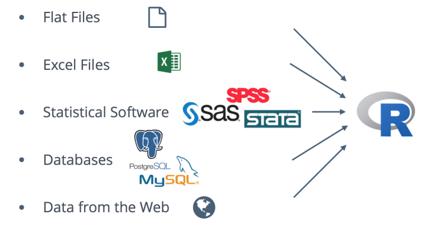
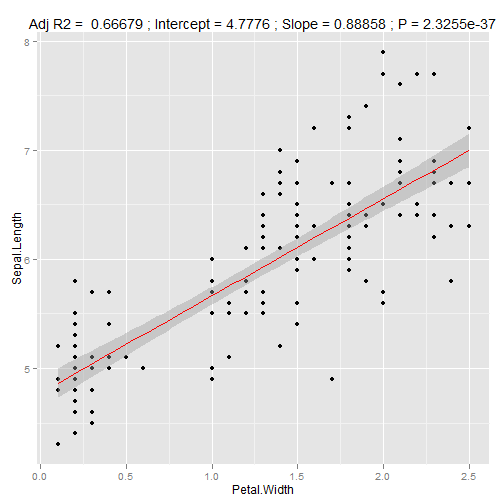

# Overview

## Goals 

### **You will learn:**

 Data science cycle (source: [R for Data Science](http://r4ds.had.co.nz/))

 

## Data import 

## Data tidying and transformation 

## Data visualisation and modeling

## Results communication 

## Outline
### __Day 3__ 

#### Data transformation with __dplyr__

* filter; arrange ; select and mutate 
* Grouping  and summarizing 
* [Less known dplyr tricks](https://www.r-bloggers.com/lesser-known-dplyr-tricks/)

#### Data wrangling

* Tibbles with **tibble**
* Data import
* tidy data with tidyr

## Outline
### __Day 4__ 

 * R markdown and  R Notebooks. 
 
 * R flexdashboard. 
 
 * Making a website Using Blogdown, Hugo, and GitHub pages.
 
 * Publish  your R postfolio on the website.  

